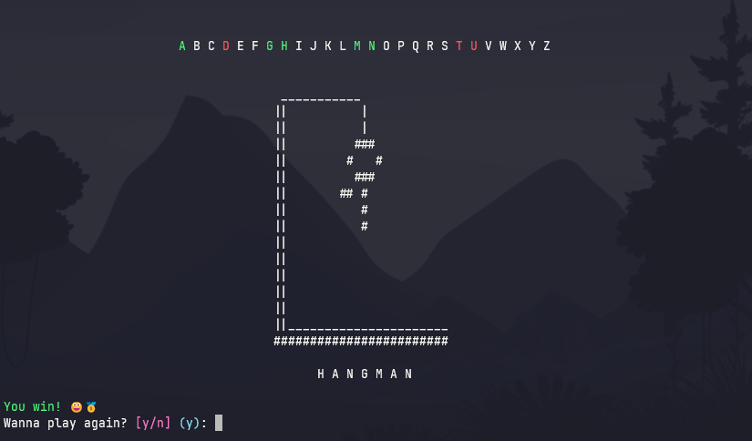

## Hangman

A small project testing the use of Rich for CLI applications.



## Installation

If you want to test the application, you can clone the repository and install it locally using pip:

```bash
git clone https://github.com/iafelipe/hangman.git
cd hangman
pip install -e .
```
Use the `-e` flag to install in editable mode, so you can change the words in `words.py` without having to reinstall it.

To run the application, just type `hangman` in the terminal.